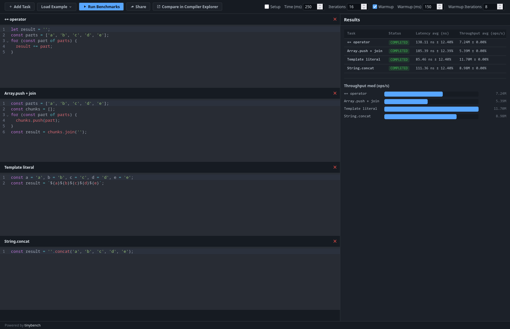

# benchpress

A browser-based playground for benchmarking JavaScript with [tinybench](https://github.com/small-tech/tinybench) — write, run, and compare snippets without leaving the tab.

**[Try it now](https://benchpress.solant.me/)**

## Features

- 📦 **Bring your own deps**: pull in any npm package straight from CDNs like [unpkg](https://unpkg.com/) or [jsDelivr](https://www.jsdelivr.com/).
- ⚙️ **Tunable measurement**: dial in the run time, iteration count, and warmup behavior (on/off, time, count).
- 📚 **Built-in examples**: jump-start your benchmark with a handful of ready-made scenarios, no blank-page syndrome.
- 🔗 **Shareable**: your setup, tasks, and config get packed into a URL, so sending someone your benchmark is just a copy-paste away.
- 🔬 **Compiler Explorer integration**: curious what V8 actually does with your code? Ship your tasks straight to [godbolt.org](https://godbolt.org) and find out.
- 🌐 **Real DOM access**: tasks run in an actual browser tab, not a stripped-down sandbox, so you can benchmark real DOM reads, writes, and layout work, not just plain JS.
- 📱 **Mobile-friendly**: a responsive layout that lets you run benchmarks and see results on phones, tablets, and fridges (probably).
